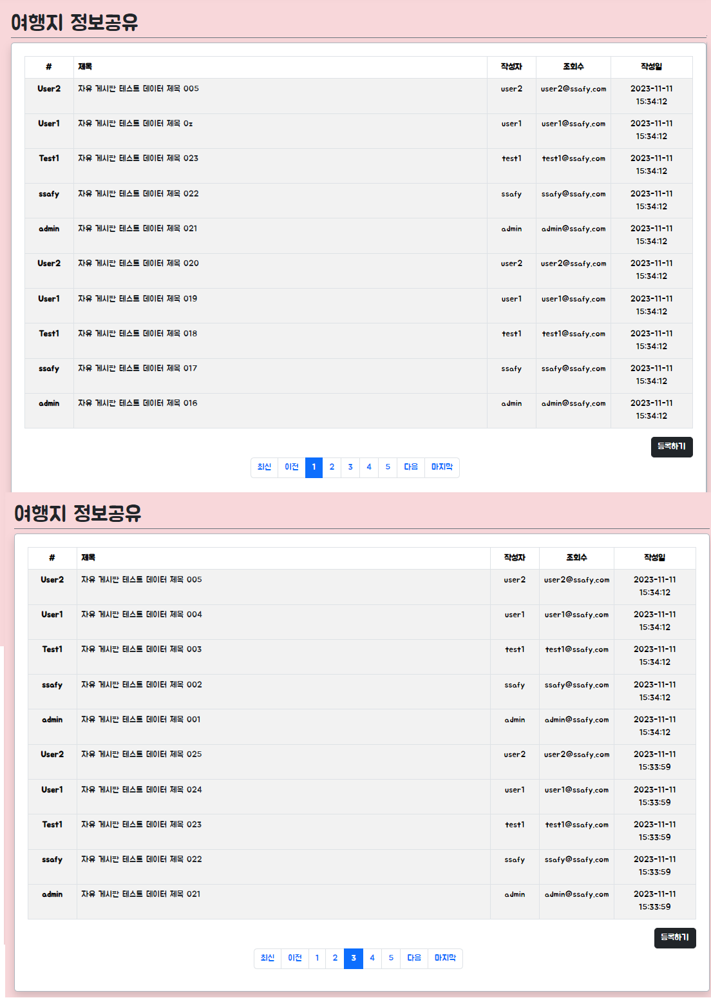

# EnjoyTrip*Vue*서울\_15반 조시훈 고석주

-   [1. Vue(Frontend)](#vuefrontend)
    -   [1. 게시글 목록](#11-게시글-목록)
    -   [2. 게시글 등록](#12-게시글-등록)
    -   [3. 게시글 수정](#13-게시글-수정)
    -   [4. 게시글 조회](#14-게시글-조회)
-   [2. SpringBoot(Backend)](#2-springbootbackend)
    -   [1. 게시글 목록](#21-게시글-목록)
    -   [2. 게시글 등록](#22-게시글-등록)
    -   [3. 게시글 수정](#23-게시글-수정)
    -   [4. 게시글 조회](#24-게시글-조회)
    -   [5. 게시글 삭제](#25-게시글-삭제)

---

## 1. Vue(Frontend)

### 1.1 게시글 목록

[[Top]](#)

### 1.2 게시글 등록

[[Top]](#)

### 1.3 게시글 수정

[[Top]](#)

### 1.4 게시글 조회

[[Top]](#)

---

## 2. SpringBoot(Backend)

### 2.1 게시글 목록

[[Top]](#)

### 2.2 게시글 등록

[[Top]](#)

### 2.3 게시글 수정

[[Top]](#)

### 2.4 게시글 조회

[[Top]](#)

### 2.5 게시글 삭제

[[Top]](#)
